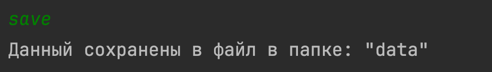

# contacts

----

### Консольное приложение для для добавления контактов

---

Приложение имеет 2 варианта запуска 

1. С профайлом default: в этом случае будет указано: spring.profiles.active=default в фалье application.properties либо будет вовсе отсутстваовать. Приложение будет работать в стандартном режиме
2. C профайлом data: в этом случае будет указано: spring.profiles.active=data в фалье application.properties. Приложение загрузит данные из файла src/main/resources/default-contacts.txt

При запуске приложения c любым профилем вам предоставиться возможность просмотривать, добавлять или удалять контакты, а так же вы можете записать контакты в файл, который находится в папке data

add - Добавить контакт (обратите внимание что в прилоджение есть валидация и вводите данные соглассно образцу)

list - Просмотреть контакты

delete - Удалить контакт по email

save - Сохранить контакт

Результат раписался в файл data/file.txt

